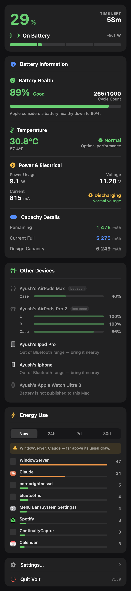
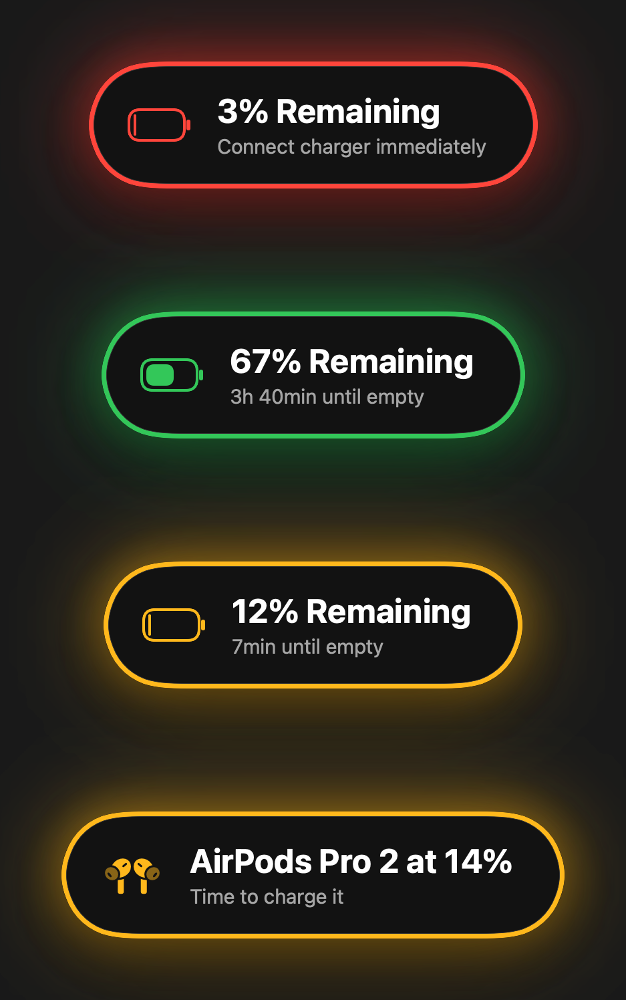
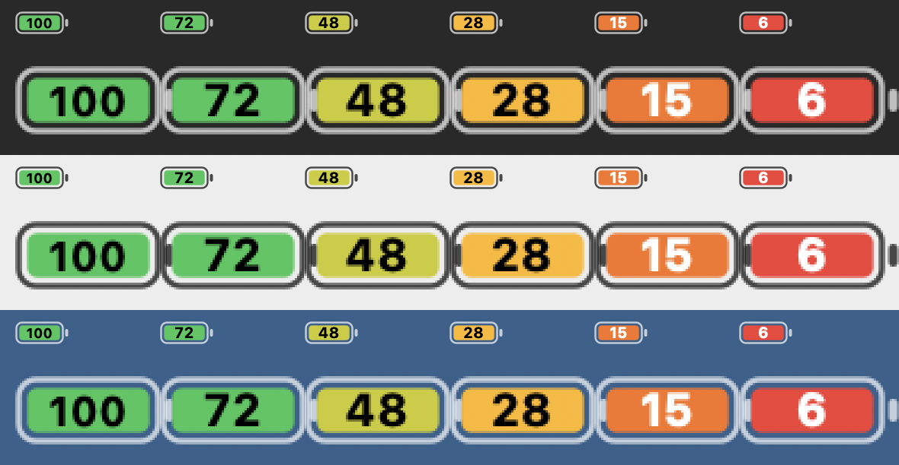

# Volt

A battery menu bar app for macOS. Custom low-battery alerts at any level you choose,
battery health and lifecycle tracking, accessory batteries, and per-app energy use.

macOS only warns you at 10% and 5%, will not let you change those levels, and shows
nothing about the health of the pack. Volt fills that in.



## What it does

**Alerts you can actually configure.** Any number of low-battery levels, each with its
own sound, colour and optional repeat. Alerts are edge-triggered — they fire when the
charge crosses a level, not for as long as it stays there — and rearm when you plug in.

An alert's colour is not just for its notification: once the charge falls to that level,
the menu bar icon and the panel's readout take the same colour. One resolver feeds all
three, so the icon and the readout can never disagree.

**Charging lifecycle.** Optional alerts for charger connected, charger pulled, reaching
80%, full charge, and the pack running hot.

**Charging is obvious.** A bolt beside the percentage and inside the battery glyph, the
state on a tinted chip, the wattage in the same colour, and a highlight running along
the meter — movement being the one cue that reads as charging without being labelled.

**A panel per topic.** Health, temperature, power, capacity, devices and energy are each
their own panel, reached from a selector at the top rather than by scrolling past
everything.

**Live electrical readings.** Current and voltage come from the SMC rather than the IO
registry. The registry republishes on its own schedule — eight seconds or more between
updates — so a readout taken from it visibly lags and repeats. The controller refreshes
about once a second, which is what makes the numbers look live.

**Power flow.** Plugged in, the adapter's output splits between charging the pack and
running the Mac — shown as two ribbons whose thickness is their share, with what the
adapter is actually delivering on one side and where the watts land on the other. On
battery it is a single ribbon flowing the other way.

The ribbons animate. Readings move continuously and a diagram that snapped between them
would be harder to read than one that flows, so the band geometry is interpolated
through `animatableData` and the figures roll over rather than cutting.

The headline figure is the delivered power, which moves with the load. The smaller one
beneath it is the negotiated USB-C contract — the ceiling the Mac and charger agreed on,
not what is printed on the brick. A 140W charger reports 100W there unless it negotiates
the extended range.

**Health.** Capacity against design capacity, cycle count, condition, temperature, live
watts / volts / amps, and raw mAh. Where macOS reports its own "Maximum Capacity"
figure, that is shown in preference to the computed one.

**Other devices.** AirPods report left, right and case separately. Magic Mouse, Magic
Keyboard and Magic Trackpad come from the IO registry. iPhone and iPad battery is read
over Bluetooth, with no cable — see below.

**Energy use.** Which apps are draining the battery, using the same Energy Impact figure
Activity Monitor shows, with 24h / 7d / 30d history kept on disk and a callout when an
app climbs well above its own baseline.



## Install

```bash
./install.sh
```

That builds, signs and installs to `/Applications`, then launches.

**Signing matters here.** macOS records Bluetooth permission against the app's code
signature. An ad-hoc signature gets a fresh hash on every build, so each rebuild looks
like a different app and macOS asks for Bluetooth access again — and the devices vanish
until you grant it. `install.sh` signs with an Apple Development certificate if you have
one, which gives a stable identity that is granted once and remembered. Without a
certificate it falls back to ad-hoc and says so.

Or open `Volt.xcodeproj` in Xcode and run. Volt lives in the menu bar and has no Dock
icon or window of its own. Left-click the icon for the panel, right-click for a menu
with **Test Alert**. Turn on **Open Volt at login** in Settings › General.

## Menu bar icon

Four styles — battery, battery with percentage inside, percentage only, and ring.

In the numbered style the shell is filled solid and the colour alone carries the level,
stepping green → lime → amber → orange → red as the charge falls. The digits are drawn
black or white by the fill's luminance, so they stay readable at every level and against
any wallpaper.



## Low Power Mode

A switch in the panel turns macOS Low Power Mode on and off, and while it is on the
battery icon turns yellow — fill and outline both, so it cannot be confused with an
alert that happens to be yellow — and the panel says so.

Reading the state is free: `ProcessInfo` reports it and posts a notification whenever it
changes. Changing it is `pmset powermode`, which only root may run, so it goes through
**VoltHelper**, a small launchd daemon registered with `SMAppService`. macOS asks you to
approve it once under System Settings › General › Login Items; after that the switch
works without a prompt. Until then — or if the helper stops answering — it falls back to
the administrator prompt.

Because the helper runs as root, it is kept narrow:

- It does one thing, setting `powermode` to 0 or 1. Its only input is a Bool; it never
  runs a command it was handed.
- It only accepts connections from Volt signed by the same team as itself, and refuses
  everything if it cannot establish its own team. Volt, in turn, only trusts a helper
  signed by its own team. An ad-hoc re-signed copy of Volt was checked and is rejected.
- It is not resident. launchd starts it when Volt connects and it exits after twenty
  idle seconds.

Remove it from Settings › General at any time.

## What it does not do

**Volt never changes how your Mac charges.** There is no charge limiting and nothing is
written to the SMC or the charging controller. The 80% alert tells you to unplug; it
does not unplug for you.

Some things macOS simply does not expose:

- **Apple Watch battery.** The Mac cannot read it by any route: the Bluetooth report
  carries no battery keys for it, it accepts a Bluetooth connection but exposes no
  battery service, and it does not send the advertisement AirPods use. Relaying it
  through companion apps on the watch and iPhone works, but a free Apple ID re-signs such
  apps every seven days, so it is not included.
- **iPhone / iPad health and cycle count.** `system_profiler` reports nothing for these
  devices, and the health figures live behind `MobileDevice.framework`, which needs the
  device plugged in and trusted at least once.

Also not built: desktop widgets, and auto-dismissing macOS's own low-battery popups.

## AirPods

macOS stops publishing a battery level for some accessories once they are actually
connected — AirPods Max report one while idle and nothing at all while in use — and they
do not expose the standard Bluetooth battery service either, which a GATT connection
confirms.

What they do broadcast is Apple's undocumented "proximity pairing" advertisement, which
carries the levels as nibbles counting tens. The layout in `ContinuityDecoder` was
written against captured bytes and checked against levels macOS reports for the same
device: a pair whose real levels were 91% / 91% / 78% decoded as 90% / 90% / 80%, which
is the format's resolution.

The hard part is attribution. The advertisement carries a model number but no stable
identifier — the address is randomised and the rest of the payload encrypted — so a
neighbour's AirPods of the same model look identical to yours. Readings are only
accepted for models paired to this Mac, only from the closest broadcaster of that model,
and only above a signal threshold. They also never replace a level macOS reports, since
that one is exact and complete; a decoded level is rounded and can be missing a pod.
Rounded values are shown with a `~`.

Exact levels come first from IOBluetooth, which still holds them after macOS stops
putting them in its report — the same figures the Sound menu shows, behind properties
that are not in the public headers. The broadcast decode only fills what is still empty.

Anything still without a level is listed with the reason rather than hidden, and the
last level seen is remembered so a device that stops reporting keeps its number. The
exception is a bare Bluetooth LE link with no battery and no history: headphones sitting
in a drawer can hold one, and it says nothing about the device being in use. Right-click
any device to hide it; hidden devices can be shown again from Settings › Devices.

## iPhone and iPad

The live percentage comes from Bluetooth. An iPhone or iPad exposes the standard GATT
**Battery Service** (`0x180F`) with the **Battery Level** characteristic (`0x2A19`) — a
public Bluetooth profile, nothing Apple-specific — so an ordinary `CBCentralManager` can
read it. The device needs to be paired with the Mac and in range; no cable and no
pairing record are required.

Finding the device takes three routes, because no one of them is dependable. A phone
that happens to be BLE-connected turns up through `retrieveConnectedPeripherals`, but
that connection comes and goes with Continuity and is often absent even with the phone
right there. Devices seen before are retrieved by identifier and given a connect request
that stays pending until they are reachable, so they return on their own. Anything new
has to be scanned for — and the scan cannot filter on the battery service, because an
iPhone advertises Apple's own payload and never mentions `0x180F`. The scan is therefore
unfiltered, and candidates are chosen from the advertisement.

A reading is kept when the connection drops, marked as stale, rather than blanked: a
phone flits in and out of range constantly and the panel would otherwise flicker.

This is deliberately separate from the `MobileDevice.framework` path, which is used only
for health, cycle count and lifetime stats and does need a cable.

macOS asks for Bluetooth permission the first time Volt scans. If the prompt does not
appear, allow Volt under System Settings › Privacy & Security › Bluetooth.

## How it reads the battery

| Data | Source |
| --- | --- |
| Charge, health, cycles, temperature | `AppleSmartBattery` in the IO registry |
| Current, voltage, adapter input | `AppleSMC` keys `B0AC`, `B0AV`, `PDTR`, `PPBR` |
| Adapter output fallback | `BatteryData.AdapterPower` |
| Change notifications | `IOPSNotificationCreateRunLoopSource`, plus a `kIOGeneralInterest` notification on the battery itself |
| Condition, Apple's Maximum Capacity | `system_profiler SPPowerDataType`, every 15 min |
| AirPods and Bluetooth accessories | `system_profiler SPBluetoothDataType` |
| Magic Mouse / Keyboard / Trackpad | `ioreg -k BatteryPercent` |
| Per-app energy | `top -stats pid,cpu,power,command` |
| iPhone / iPad level | CoreBluetooth GATT `0x180F` / `0x2A19` |
| iPhone / iPad health (cable) | `MobileDevice.framework`, resolved with `dlsym` |

Nothing leaves the machine. Preferences and energy history live in
`~/Library/Application Support/Volt/`.

## Troubleshooting

Create `~/.volt-debug` and restart Volt to have it append what it finds — Bluetooth
state, discovered devices and their levels — to `~/.volt-debug.log`. Delete the marker
file to turn it off again.

## Notes

Alerts are shown as Volt's own on-screen HUD rather than through Notification Center,
because an ad-hoc signed build cannot reliably obtain notification authorization.
Notification Center delivery is available as an option in Settings.

Requires macOS 14 or later. Built and tested on macOS 26 with Xcode 27.
